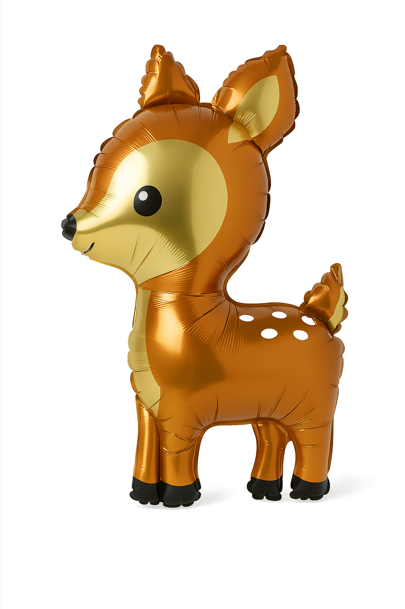
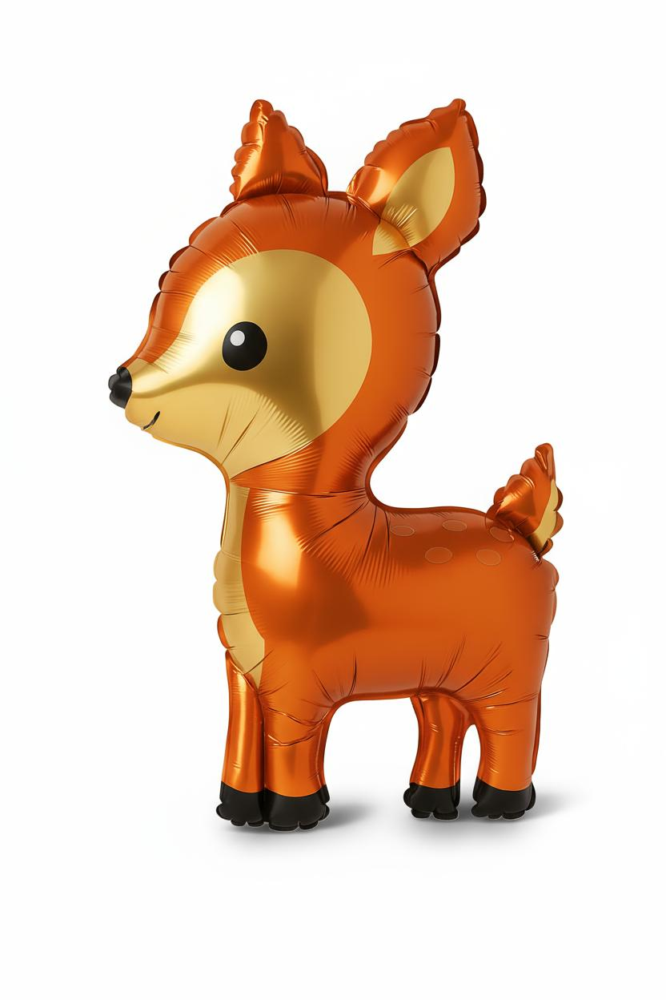
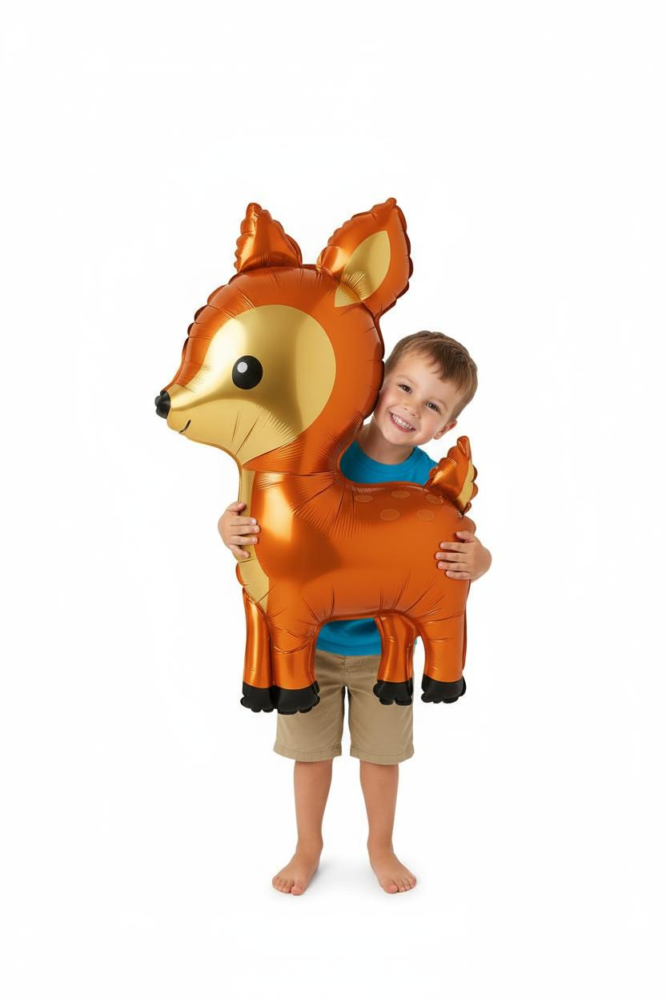
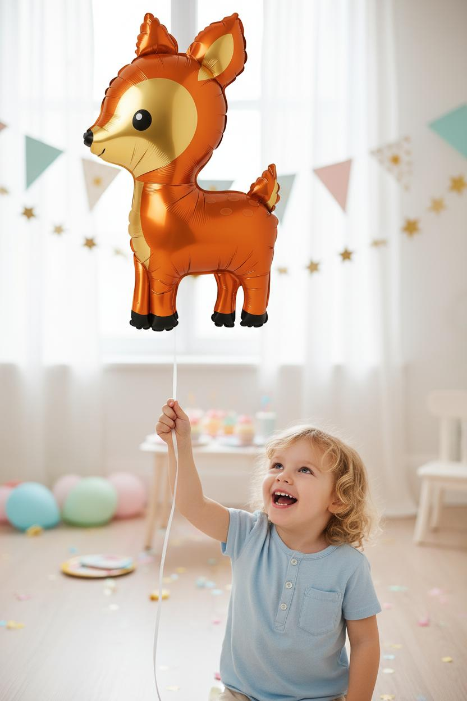

# Project Demo: Vertex AI Product Imagery Generator

This folder showcases the results of the automated image generation pipeline.

---

### 📥 Input Image

This is the original, basic product photo used as input for the entire process.

---

### 📤 AI-Generated Outputs

The following images were automatically generated by the script from the single input photo above.

#### Step 1: Studio Shot

The original image was enhanced, and the product was placed on a clean, white background, ready for e-commerce listings.

#### Step 2: Lifestyle Scene 1 (Child)

A lifestyle scene featuring a child was generated based on the enhanced studio shot.

#### Step 3: Lifestyle Scene 2 (Party)

A second, birthday-themed lifestyle arrangement was created to showcase the product in a different context.

